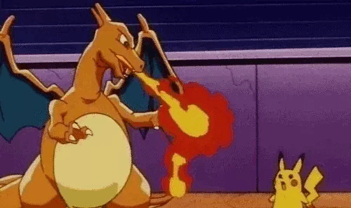
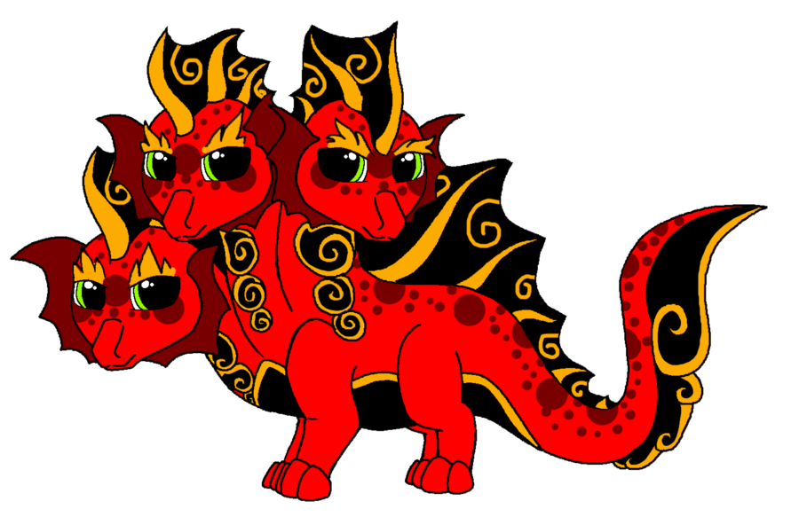

## :fire: Hello there, and here's a pokemon battle

Flame and zap, what can I say?

 

## :fire: Three heads are better then one!

:dragon: Yes that's a hydra joke BTW.

## :fire: Heres my stats card!
  

## :book: Sign my guest book please 

<!--START:guestbook--> <!--END:guestbook-->

  

